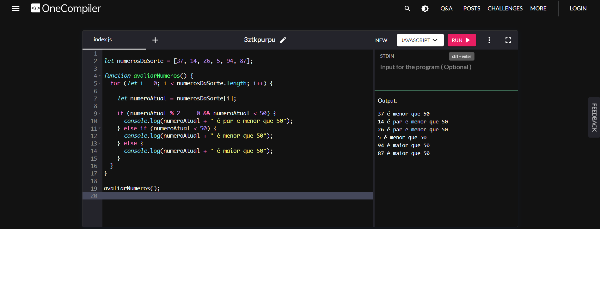

## Verificando os números da lista

### Instruções do projeto
```
Acesse o site OneCompiler, copie e cole o array 'numerosDaSorte', e logo em seguida escreva o código necessário para avaliar cada elemento do array e imprimir uma frase seguindo algum dos seguintes três modelos:

- X é par e menor que 50
- X é menor que 50
- X é maior que 50

  numerosDaSorte = [37, 14, 26, 5, 94, 87]  
```

### Código

<!-- Imagem -->



<!-- Código JavaScript-->
~~~javascript
// Verificando os números da lista

let numerosDaSorte = [37, 14, 26, 5, 94, 87];

function avaliarNumeros() {
    for (let i = 0; i < numerosDaSorte.length; i++) {
        
        let numeroAtual = numerosDaSorte[i];

    if (numeroAtual % 2 === 0 && numeroAtual < 50) {
        console.log(numeroAtual + " é par e menor que 50");
    } else if (numeroAtual < 50) {
        console.log(numeroAtual + " é menor que 50");
    } else {
        console.log(numeroAtual + " é maior que 50");
    }
  }
}

avaliarNumeros();
~~~