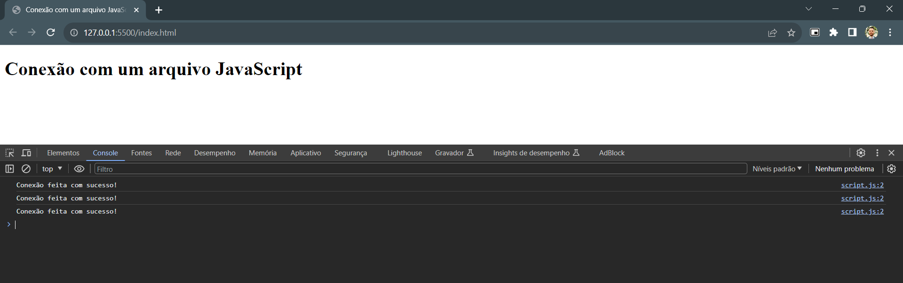

## Conectando o HTML com o JavaScript

### Instruções do projeto

Crie um novo projeto com dois arquivos: index.html e script.js. No arquivo HTML, defina a estrutura padrão HTML, e inclua uma tag h1 com o título "Conexão com um arquivo JavaScript". No arquivo JavaScript defina uma função que imprima a mensagem "Conexão feita com sucesso!" no terminal, e execute ela três vezes. Finalmente, conecte ambos arquivos, abra seu projeto no navegador usando a extensão LiveServer e confira se a mensagem foi impressa três vezes no terminal.

<!-- Código HTML-->

### Código HTML

```html
<!DOCTYPE html>
<html lang="pt-br">
	<head>
		<meta charset="UTF-8" />
		<meta name="viewport" content="width=device-width, initial-scale=1.0" />
		<title>Conexão com um arquivo JavaScript</title>
		<script src="script.js" defer></script>
	</head>
	<body>
		<h1>Conexão com um arquivo JavaScript</h1>
	</body>
</html>
```
[Clique para acessar o arquivo HTML](index.html)

<!-- Código JavaScript -->

### Código JavaScript


```javascript
function imprimirMensagem() {
    console.log("Conexão feita com sucesso!");
}

imprimirMensagem();
imprimirMensagem();
imprimirMensagem();
```

[Clique para acessar o arquivo JavaScript](script.js)

### Resultado

<!-- Imagem -->

