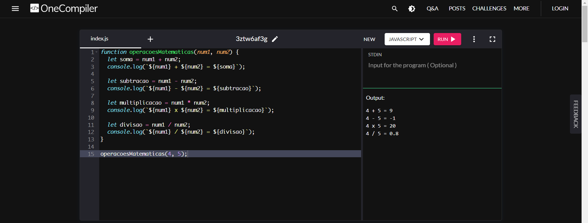

## Criando função de operações matemáticas

### Instruções do projeto

Acesse o site OneCompiler (https://onecompiler.com/javascript/) e crie uma função que recebe dois números como parâmetros e imprime quatro frases no terminal (a partir de template strings) demonstrando as quatro operações básicas aplicadas a ambos números. Exemplo:

> 4 + 5 = 9 </br>
> 4 - 5 = -1 </br>
> 4 x 5 = 20 </br>
> 4 / 5 = 0.8

<!-- Código JavaScript -->

### Código JavaScript

```javascript
function operacoesMatematicas(num1, num2) {
	let soma = num1 + num2;
	console.log(`${num1} + ${num2} = ${soma}`);

	let subtracao = num1 - num2;
	console.log(`${num1} - ${num2} = ${subtracao}`);

	let multiplicacao = num1 * num2;
	console.log(`${num1} x ${num2} = ${multiplicacao}`);

	let divisao = num1 / num2;
	console.log(`${num1} / ${num2} = ${divisao}`);
}

operacoesMatematicas(4, 5);
```

[Clique para acessar o arquivo JavaScript](script.js)

### Resultado

<!-- Imagem -->


