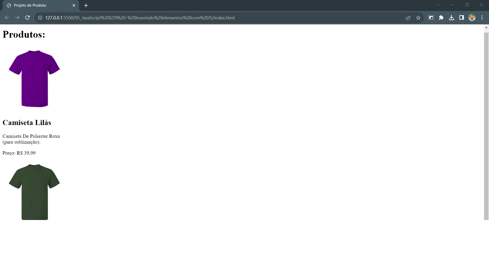

## Adicionando elementos com JS

### Instruções do projeto

Crie um projeto com dois arquivos: index.html e script.js. No arquivo 'index' insira apenas a estrutura base HTML e a tag script para conectar o arquivo HTML com o arquivo de extensão JavaScript.

Usando os conceitos aprendidos nesse módulo, e sem alterar o arquivo index.html, adicione um título simples ao site com o id 'titulo', e um elemento que represente um produto à venda. O produto precisa incluir pelo menos o nome, a descrição e o preço. Pode incluir outros "elementos filhos" se achar necessário como, por exemplo, uma imagem. Procure usar o método simples e o método complexo, ensinados neste tópico.

<!-- Código HTML-->

### Código HTML

```html

<!DOCTYPE html>
<html lang="pt-br">
	<head>
		<meta charset="UTF-8" />
		<meta name="viewport" content="width=device-width, initial-scale=1.0" />
		<title>Projeto de Produto</title>
		<script defer src="script.js"></script>
	</head>
	<body>

	</body>
</html>

```

[Clique para acessar o arquivo HTML](index.html)

<!-- Código JavaScript -->

### Código JavaScript

```javascript

let tituloProduto = document.createElement('h1');
tituloProduto.innerHTML = 'Produtos: ';
document.body.appendChild(tituloProduto);

let produto1 = document.createElement('div');
produto1.innerHTML = `
    
    <h2>Camiseta Lilás</h2>
    <p>Camiseta De Poliester Roxa </br>(para sublimação).</p>
    <p>Preço: R$ 39,99</p>
`;
document.body.appendChild(produto1);

let produto2 = document.createElement('div');
produto2.innerHTML = `
    
    <h2>Camiseta Verde</h2>
    <p>Camiseta De Poliester Verde </br>(para sublimação).</p>
    <p>Preço: R$ 39,99</p>
`;
document.body.appendChild(produto2);

```

[Clique para acessar o arquivo JavaScript](script.js)

### Resultado

<!-- Imagem -->


