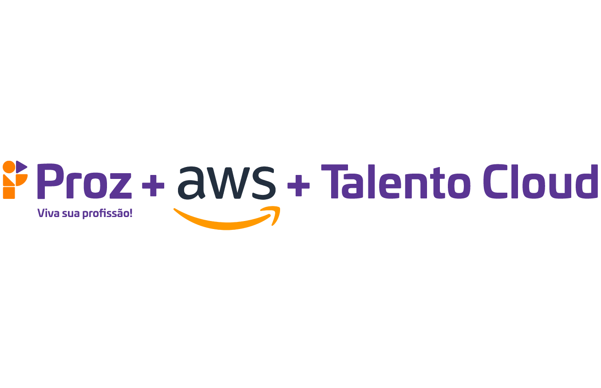

# 📚 Repositório do Curso "Talento Cloud"

Bem-vindo a repositório do **Curso "Talento Cloud"** oferecido pela 🌟 AWS 🌟 em parceria com a **PROZ Educação**. Este repositório é dedicado ao armazenamento de atividades e projetos realizados durante o curso.

## 📂 Estrutura do Curso
O curso "Talento Cloud" está estruturado em vários módulos que preparam você para uma carreira de sucesso na área Front-End. Abaixo está a estrutura do curso:

01. **Lógica Imperativa**
02. **Introdução à Programação**
03. **Preparação para HTML e CSS**
04. **HTML-CSS**
05. **JavaScript I**
06. **JavaScript II**
07. **Banco de Dados I**
08. **Banco de Dados II**

Cada módulo contém atividades práticas e projetos realizados a fim de aprimorar as habilidades em desenvolvimento Front-End.

## 📁 Como Navegar Neste Repositório
Dentro deste repositório, você encontrará uma estrutura organizada para cada módulo do curso. Para acessar as atividades e projetos de um módulo específico, basta navegar até a pasta correspondente.

Por exemplo, para acessar as atividades do módulo "JavaScript I", vá até a pasta "05_JavaScript I". Você encontrará informações e arquivos relacionados a esse módulo.

## 🚀 O Programa

O curso "Talento Cloud" é uma oportunidade incrível para mergulhar no mundo da programação e da computação em nuvem.

A formação abrange duas trilhas principais:

1. **Introdução à programação com foco em Front-End**
2. **Cloud Practitioner**

O Talento Cloud Pro é um programa criado pela AWS para capacitar pessoas formadas em escola pública para trabalhar em uma das tecnologias que mais crescem no mundo: computação em nuvem.

A formação abrange um total de 300 horas de aulas e exercícios, tendo uma duração de 4 meses com aulas ao vivo.

## 📋 Projeto Integrador - Final de curso com Front-end

O Projeto Integrador é uma entrega que deve refletir os conteúdos vistos durante o curso em forma de um produto que será capaz de atender uma determinada demanda. Ao final do curso os alunos deverão entregar um sistema web com foco no front-end, se baseando em um problema real e que possa ser contemplado ao final pensando em um usuário final.
